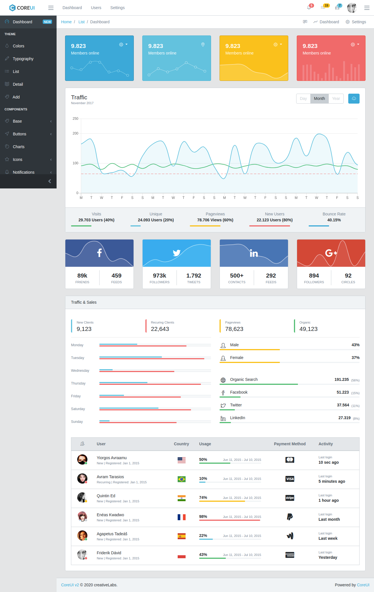

# coreui-django-boilerplate-v2 (2020)

This is the [CoreUI v2](https://coreui.io/demo/2.0/#main.html) template that can be used as a base template in Django.

* Clone this repo
* Create a Django project
* Create a App Core
* Copy this template on `core/templates` folder

Contains:

* [contrib/env_gen.py](https://gist.github.com/rg3915/75eed74f3578ac0dde808b1194b0e486)
* requirements.txt
* [select2.js](https://select2.org/)




## This project was done with:

* [Python 3.8.2](https://www.python.org/)
* [Django 2.2.16](https://www.djangoproject.com/)
* [Bootstrap 4.0](https://getbootstrap.com/)
* [jQuery 3.4.1](https://jquery.com/)

## How to run project?

* Clone this repository.
* Create virtualenv with Python 3.
* Active the virtualenv.
* Install dependences.
* Run the migrations.

```
git clone https://github.com/rg3915/coreui-django-boilerplate-v2.git
cd coreui-django-boilerplate-v2
python -m venv .venv
source .venv/bin/activate
pip install -r requirements.txt
python contrib/env_gen.py
python manage.py migrate
```

## Este projeto foi feito com:

* [Python 3.8.2](https://www.python.org/)
* [Django 2.2.16](https://www.djangoproject.com/)
* [Bootstrap 4.0](https://getbootstrap.com/)
* [jQuery 3.4.1](https://jquery.com/)

## Como rodar o projeto?

* Clone esse repositório.
* Crie um virtualenv com Python 3.
* Ative o virtualenv.
* Instale as dependências.
* Rode as migrações.

```
git clone https://github.com/rg3915/coreui-django-boilerplate-v2.git
cd coreui-django-boilerplate-v2
python3 -m venv .venv
source .venv/bin/activate
pip install -r requirements.txt
python contrib/env_gen.py
python manage.py migrate
```